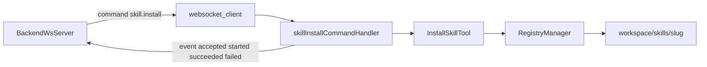

# WebSocket Skill Install

This document describes the dedicated WebSocket command flow for installing skills into a PicoClaw pod.

It is specifically about the `skill.install` command handled by the `websocket_client` channel. Unlike LLM-driven skill installation, this flow is backend-orchestrated and bypasses the normal message bus and agent response path.

## Purpose

Use `skill.install` when your backend needs to instruct a specific PicoClaw pod to install a skill directly.

Typical use cases:

- Marketplace-driven install selected in your app or backend
- Tenant-specific skill rollout
- Operator-triggered repair or reinstall
- Backend-controlled version pinning for a pod

## How It Works



At a high level:

1. Backend sends a WebSocket frame with `type: "command"`.
2. PicoClaw validates the command and emits `skill.install.accepted`.
3. PicoClaw runs the installation asynchronously with bounded concurrency.
4. PicoClaw emits terminal status back to the backend as `type: "event"`.

## Current Implementation Scope

The current implementation supports exactly one command:

- `skill.install`

The command is implemented in:

- `pkg/channels/websocket_client/commands_skill_install.go`

The installer reuses the existing install logic from:

- `pkg/tools/skills_install.go`

That means this flow inherits the existing install behavior:

- installs into `{workspace}/skills/{slug}`
- validates `slug` and `registry`
- uses configured skill registries
- writes `.skill-origin.json`
- blocks malware-flagged installs
- removes partial installs on failure

## Enabling the Feature

This feature is disabled by default.

Example `config.json`:

```json
{
  "channels": {
    "websocket_client": {
      "enabled": true,
      "backend_url": "wss://backend.internal/ws",
      "auth_token": "your-secret-token",
      "commands": {
        "enabled": true,
        "max_concurrent": 1,
        "install_timeout_sec": 120,
        "dedup_ttl_sec": 300,
        "allowed_registries": ["clawhub"],
        "default_registry": "clawhub"
      }
    }
  }
}
```

Supported environment variables for command settings:

- `PICOCLAW_CHANNELS_WEBSOCKETCLIENT_COMMANDS_ENABLED`
- `PICOCLAW_CHANNELS_WEBSOCKETCLIENT_COMMANDS_MAX_CONCURRENT`
- `PICOCLAW_CHANNELS_WEBSOCKETCLIENT_COMMANDS_INSTALL_TIMEOUT_SEC`
- `PICOCLAW_CHANNELS_WEBSOCKETCLIENT_COMMANDS_DEDUP_TTL_SEC`
- `PICOCLAW_CHANNELS_WEBSOCKETCLIENT_COMMANDS_DEFAULT_REGISTRY`

Notes:

- `allowed_registries` is currently configured via JSON, not via a dedicated env var.
- If `default_registry` is empty, every request must provide `registry`.
- If `allowed_registries` is non-empty, PicoClaw rejects any registry outside that allowlist.

## Inbound Command Contract

Backend sends a normal WebSocket message envelope with:

- `type = "command"`
- `metadata.command_name = "skill.install"`
- `content = "<JSON string payload>"`

Example:

```json
{
  "type": "command",
  "content": "{\"request_id\":\"req-123\",\"slug\":\"docker-compose\",\"registry\":\"clawhub\",\"version\":\"1.2.0\",\"force\":false,\"timeout_sec\":60}",
  "metadata": {
    "command_name": "skill.install"
  }
}
```

### Payload Fields

The JSON stored in `content` is decoded into this shape:

```json
{
  "request_id": "req-123",
  "slug": "docker-compose",
  "registry": "clawhub",
  "version": "1.2.0",
  "force": false,
  "timeout_sec": 60
}
```

Field behavior:

- `request_id`
  - required
  - used for idempotency and duplicate suppression
  - if omitted in payload, PicoClaw falls back to `metadata.request_id`
- `slug`
  - required
  - must pass `ValidateSkillIdentifier`
- `registry`
  - optional only when `default_registry` is configured
  - must pass `ValidateSkillIdentifier`
- `version`
  - optional
  - empty means registry default/latest behavior
- `force`
  - optional
  - if `true`, PicoClaw removes the existing install directory before reinstalling
- `timeout_sec`
  - optional
  - only shortens the request timeout; it cannot extend beyond configured server timeout

## Outbound Event Contract

PicoClaw reports command lifecycle using `type: "event"`.

Example:

```json
{
  "type": "event",
  "content": "skill installation started",
  "metadata": {
    "event_name": "skill.install.started",
    "request_id": "req-123",
    "slug": "docker-compose",
    "registry": "clawhub",
    "pod_hostname": "picoclaw-user-123",
    "timestamp": "2026-03-06T14:00:00Z"
  }
}
```

### Event Names

- `skill.install.accepted`
- `skill.install.started`
- `skill.install.succeeded`
- `skill.install.failed`

### Common Metadata

- `event_name`
- `request_id`
- `slug`
- `registry`
- `pod_hostname`
- `timestamp`

Terminal events also include:

- `duration_ms`

Failure events also include:

- `error_code`

## Lifecycle Semantics

### 1. Accepted

Sent after basic validation and request registration succeed.

Example:

```json
{
  "type": "event",
  "content": "skill install request accepted",
  "metadata": {
    "event_name": "skill.install.accepted",
    "request_id": "req-123",
    "slug": "docker-compose",
    "registry": "clawhub"
  }
}
```

### 2. Started

Sent when a worker slot is acquired and install work begins.

### 3. Succeeded

Sent when installation completes successfully.

Important detail:

- The `content` comes from the underlying install tool and may include a human-readable success message and warnings about suspicious content.

### 4. Failed

Sent when validation fails, the install fails, or a request cannot proceed.

Important detail:

- Failure content comes from the underlying tool or handler validation.
- `error_code` is the stable machine-readable field your backend should use for routing and retries.

## Error Codes

Current error codes emitted by this feature:

- `commands_disabled`
  - command received but command handling is not enabled on the pod
- `unsupported_command`
  - `metadata.command_name` is not `skill.install`
- `invalid_command_payload`
  - malformed JSON or missing required payload fields
- `registry_required`
  - request omitted `registry` and no `default_registry` is configured
- `registry_not_allowed`
  - registry is not permitted by `allowed_registries`
- `invalid_slug`
  - invalid skill slug
- `invalid_registry`
  - invalid registry identifier
- `install_failed`
  - the installer returned an error
- `request_canceled`
  - request context was canceled before a worker slot was acquired
- `send_event_failed`
  - PicoClaw could not send the initial `accepted` event

## Idempotency and Duplicate Handling

Idempotency is per pod and in-memory.

Behavior by `request_id`:

- first request
  - accepted and executed normally
- duplicate while original is still running
  - PicoClaw emits `skill.install.accepted`
  - metadata contains `already_in_progress = "true"`
  - no second install is started
- duplicate after original completed and result is still cached
  - PicoClaw replays the cached terminal event
  - metadata contains `replayed = "true"`

Important operational note:

- The dedup cache lives only in memory.
- If the pod restarts, cached request state is lost.
- Backend should not assume cross-restart idempotency.

## Concurrency Model

Install work is asynchronous and bounded by `max_concurrent`.

Behavior:

- validation and acceptance happen in the read path
- actual installs run in goroutines
- a semaphore limits concurrent installs
- the WebSocket read loop is not blocked by long-running installs

Recommended settings:

- low-resource pods: `max_concurrent = 1`
- larger pods with controlled registry traffic: `max_concurrent = 2` or higher after load testing

## Filesystem Behavior

The current install target is:

- `{workspace}/skills/{slug}`

This is the same path used by the existing `install_skill` tool.

In Kubernetes:

- make sure the workspace path is writable
- do not point dynamic installs at a ConfigMap-mounted directory
- keep builtin/operator-managed skills separate from workspace-installed skills

Related reading:

- `docs/builtin-skills.md`

## Backend Responsibilities

Backend should treat PicoClaw as an execution target, not a policy engine.

Recommended backend responsibilities:

- decide which pod receives the command
- generate unique `request_id` values
- validate tenant permissions and catalog access
- pin allowed `slug`, `registry`, and `version`
- persist lifecycle state based on event messages
- enforce retry policy on timeouts or disconnects

Suggested backend state model:

- `QUEUED`
- `DISPATCHED`
- `ACCEPTED`
- `STARTED`
- `SUCCEEDED`
- `FAILED`

## Retry Guidance

Suggested backend handling:

- if no `accepted` event arrives within a short timeout:
  - treat dispatch as uncertain
  - retry carefully with the same `request_id` if the pod connection is known healthy
- if pod disconnects before terminal status:
  - treat the job as unknown state
  - reconcile by retrying or re-querying using your own control plane logic
- use `request_id` to avoid duplicate installs on repeated dispatches

## Security Considerations

This feature assumes the backend WebSocket channel is trusted infrastructure.

Minimum recommendations:

- use `wss://`
- require pod-to-backend authentication via bearer token or stronger transport controls
- only allow approved registries through `allowed_registries`
- do not allow arbitrary URL-based installs through this command path
- monitor install failures and repeated duplicate requests

Defense-in-depth recommendations:

- authenticate the backend strongly before accepting command traffic
- ensure only your backend can route commands to a pod
- audit every `skill.install` request with `request_id`, pod identity, tenant identity, slug, registry, and outcome

## Current Limitations

These are important to know before relying on this flow operationally:

- only `skill.install` is supported today
- command dedup is in-memory only
- lifecycle events are best-effort after execution starts
- there is no dedicated uninstall or upgrade command yet
- there is no persisted command/job store inside PicoClaw

## Example End-to-End Flow

Backend sends:

```json
{
  "type": "command",
  "content": "{\"request_id\":\"req-42\",\"slug\":\"github\",\"registry\":\"clawhub\"}",
  "metadata": {
    "command_name": "skill.install"
  }
}
```

PicoClaw emits:

```json
{
  "type": "event",
  "content": "skill install request accepted",
  "metadata": {
    "event_name": "skill.install.accepted",
    "request_id": "req-42",
    "slug": "github",
    "registry": "clawhub"
  }
}
```

Then:

```json
{
  "type": "event",
  "content": "skill installation started",
  "metadata": {
    "event_name": "skill.install.started",
    "request_id": "req-42",
    "slug": "github",
    "registry": "clawhub"
  }
}
```

Then:

```json
{
  "type": "event",
  "content": "Successfully installed skill \"github\" v1.0.0 from clawhub registry.",
  "metadata": {
    "event_name": "skill.install.succeeded",
    "request_id": "req-42",
    "slug": "github",
    "registry": "clawhub",
    "duration_ms": "418"
  }
}
```

## Related Files

- `pkg/channels/websocket_client/websocket_client.go`
- `pkg/channels/websocket_client/commands_skill_install.go`
- `pkg/tools/skills_install.go`
- `pkg/config/config.go`
- `pkg/config/defaults.go`
- `docs/channels/websocket_client/README.md`
