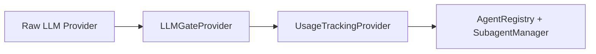
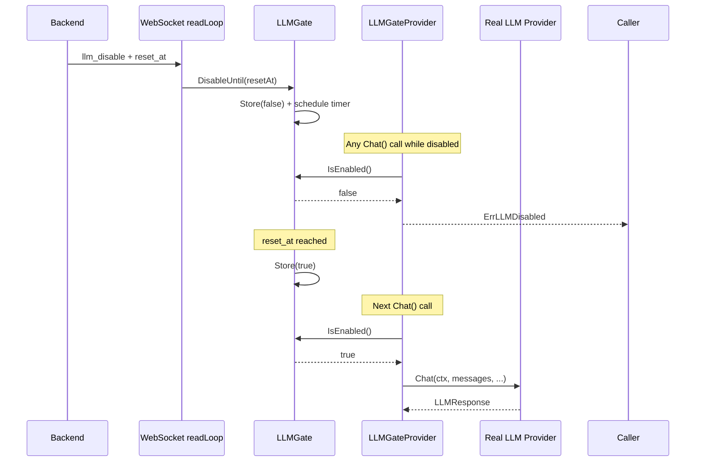
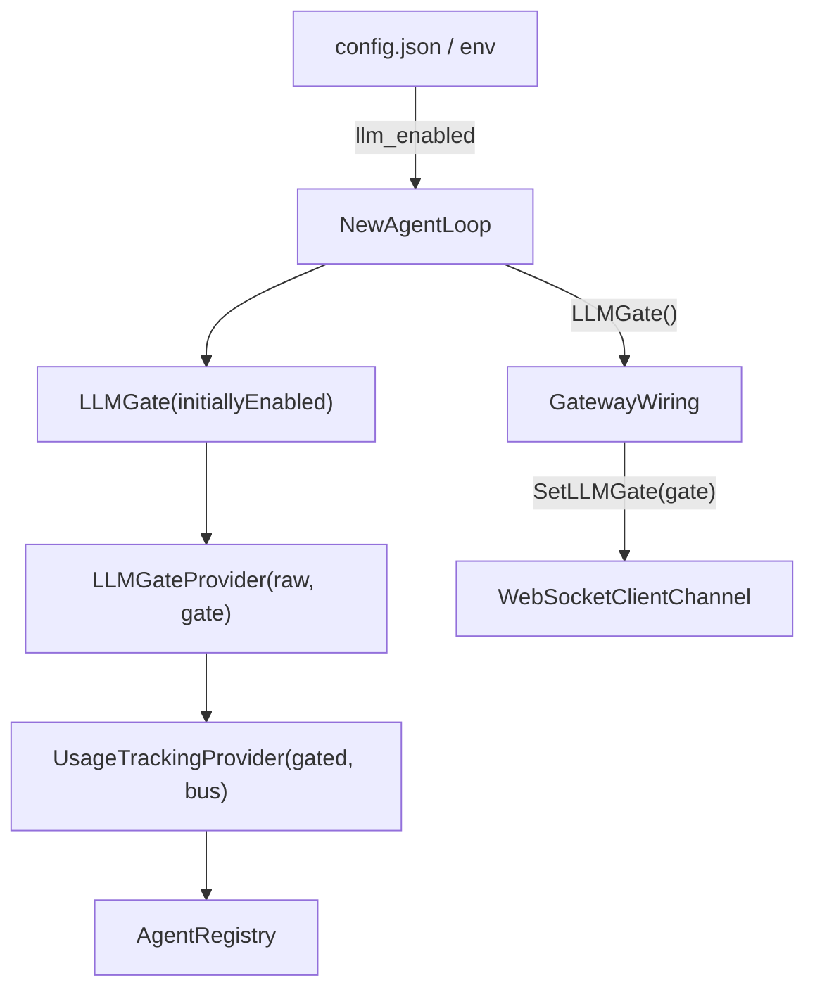
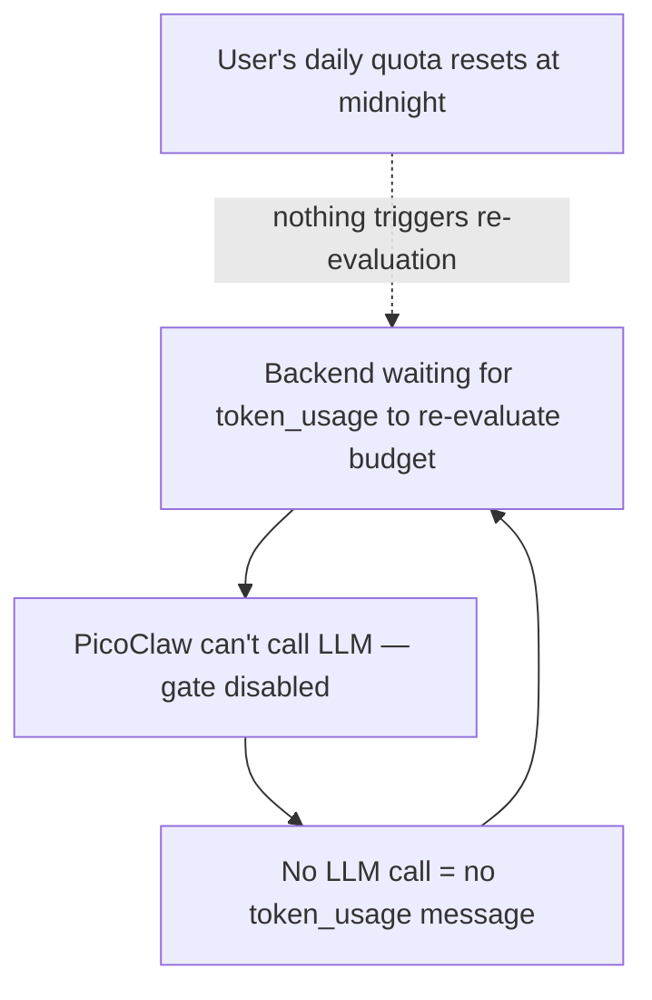
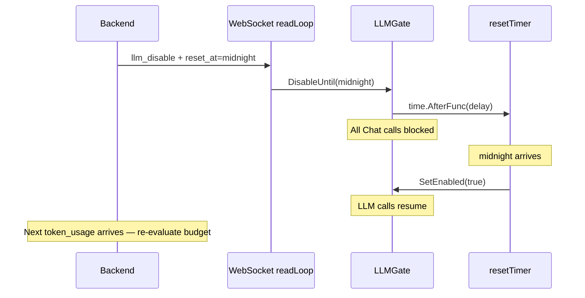

# LLM Gate — Backend-Controlled Kill Switch

PicoClaw includes a runtime LLM gate that the backend can toggle via WebSocket messages. When the gate is closed, **every** `Chat()` call in the system is rejected immediately — no tokens are consumed, no usage is reported, no API calls leave the pod. This covers user-initiated messages, cron jobs, heartbeats, subagents, summarization, and any other LLM call source.

---

## Why

Blocking inbound messages at the backend is not enough. Once a pod receives work, background tasks (cron agents, async subagents, heartbeat handlers, summarization) can continue to make LLM calls even after the user exceeds their token budget. The gate solves this by cutting off LLM access at the provider level inside the pod itself.

---

## Architecture

### Provider chain



The `LLMGateProvider` wraps the raw provider **before** usage tracking. When the gate is closed:

1. `Chat()` returns `ErrLLMDisabled` immediately.
2. The call never reaches the real provider — no API request, no tokens consumed.
3. The call never reaches `UsageTrackingProvider` — no phantom usage reported.

### Toggle flow



### Startup wiring



1. `NewAgentLoop` reads `cfg.LLMEnabled` and creates the gate.
2. The gate is inserted into the provider chain: raw → gate → tracking → consumers.
3. Gateway startup passes the gate to the WebSocket channel via `SetLLMGate`.
4. The WebSocket `readLoop` toggles the gate on `llm_disable` / `llm_enable` messages.

---

## WebSocket Messages

### Inbound (backend → picoclaw)

Disable all LLM calls (indefinitely):

```json
{"type": "llm_disable"}
```

Disable all LLM calls with automatic re-enable at a specific time:

```json
{"type": "llm_disable", "reset_at": "2026-03-17T00:00:00Z"}
```

Re-enable LLM calls immediately:

```json
{"type": "llm_enable"}
```

### Fields

| Field | Required | Type | Description |
|---|---|---|---|
| `type` | Yes | string | `"llm_disable"` or `"llm_enable"` |
| `reset_at` | No | string (RFC3339) | UTC timestamp for automatic re-enablement. Only used with `llm_disable`. |

### Behaviour

| Gate state | `Chat()` result | Tokens consumed | Usage reported |
|---|---|---|---|
| Enabled | Normal response | Yes | Yes |
| Disabled | `ErrLLMDisabled` | No | No |

The gate toggle is **instantaneous** — it uses `sync/atomic.Bool` so there is no lock contention. In-flight `Chat()` calls that are already past the gate check will complete normally; only subsequent calls are blocked.

---

## Automatic Re-enable (`reset_at`)

### The Deadlock Problem

Without `reset_at`, a disabled gate can create a deadlock:



**Concrete example:**

| Time | Event |
|---|---|
| 23:01 | User exceeds 500,000 token daily budget |
| 23:01 | Backend sends `llm_disable` to PicoClaw |
| 00:00 | Daily quota resets — user has fresh 500,000 tokens |
| 00:00 | Nothing happens. Pod is still disabled. |
| 00:01 | User sends a message, but PicoClaw can't call the LLM |
| 00:01 | No `token_usage` produced → backend never re-evaluates → **deadlock** |

### How `reset_at` Breaks the Deadlock

The backend includes the quota reset time in the disable message:

```json
{"type": "llm_disable", "reset_at": "2026-03-17T00:00:00Z"}
```

PicoClaw schedules a `time.AfterFunc` timer. When `reset_at` is reached:

1. The gate auto-re-enables (`Store(true)`).
2. The next LLM call succeeds and produces a `token_usage` message.
3. The backend receives the usage, evaluates the new day's budget, and either allows the call or sends a fresh `llm_disable` with the next day's `reset_at`.



### Edge Cases

| Scenario | Behaviour |
|---|---|
| `reset_at` is in the **future** | Gate disabled, timer scheduled. Auto-re-enables at that time. |
| `reset_at` is in the **past** | Gate re-enables immediately. Handles pod reconnect after the reset window. |
| `reset_at` is **zero/omitted** | Gate disabled indefinitely. Only `llm_enable` can re-enable. |
| `reset_at` is **invalid** (not RFC3339) | Logged as warning, treated as omitted. Gate disabled indefinitely. |
| New `llm_disable` arrives while timer is pending | Old timer cancelled, new timer (or indefinite disable) replaces it. |
| `llm_enable` arrives while timer is pending | Timer cancelled. Gate re-enabled immediately. |
| Pod **restarts** while disabled | Gate initialises from `config.json` (`llm_enabled: true` by default). Backend re-evaluates on first `token_usage` after reconnect. |

---

## Configuration

### config.json

```json
{
  "llm_enabled": true,
  "agents": { "..." },
  "channels": { "..." }
}
```

| Field | Type | Default | Description |
|---|---|---|---|
| `llm_enabled` | `bool` | `true` | Initial LLM gate state when the pod starts |

### Environment variable

```bash
PICOCLAW_LLM_ENABLED=false
```

The environment variable overrides the config file value. This is useful for Kubernetes deployments where you want to start pods with LLM disabled via a ConfigMap or pod spec without modifying `config.json`.

### Use cases for starting disabled

- **Maintenance mode**: Deploy pods with `llm_enabled: false`, perform setup/migrations, then send `llm_enable` from the backend when ready.
- **Staging environments**: Start pods disabled by default and selectively enable them.
- **Budget exhaustion**: Backend detects a user exceeded their token budget, sends `llm_disable` with `reset_at` set to the next quota reset time.

---

## What Is Blocked

When the gate is disabled, **all** of the following are blocked:

| LLM Call Source | Blocked? |
|---|---|
| User-initiated message (single iteration) | Yes |
| User-initiated message (multi-iteration tool loop) | Yes — each iteration checks the gate |
| Synchronous subagent | Yes |
| Asynchronous subagent (goroutine) | Yes |
| Heartbeat handler | Yes |
| Cron job execution | Yes |
| Summarization (background) | Yes |
| Fallback / retry attempts | Yes |

Every call goes through the same provider chain, so there are no bypass paths.

---

## Implementation Details

### Files

| File | Role |
|---|---|
| `pkg/providers/llm_gate.go` | `LLMGate` (atomic toggle + reset timer) and `LLMGateProvider` (provider wrapper) |
| `pkg/providers/llm_gate_test.go` | Unit tests for gate toggle, timer, and provider wrapper |
| `pkg/config/config.go` | `LLMEnabled bool` field on `Config` struct |
| `pkg/config/defaults.go` | Default value `true` in `DefaultConfig()` |
| `pkg/agent/loop.go` | Creates the gate, inserts into provider chain, exposes `LLMGate()` getter |
| `pkg/channels/websocket_client/websocket_client.go` | `SetLLMGate` setter, `llm_disable` / `llm_enable` handling in `readLoop` |
| `pkg/channels/websocket_client/websocket_client_test.go` | Integration tests for reset_at WebSocket handling |
| `cmd/picoclaw/internal/gateway/helpers.go` | Passes gate from `AgentLoop` to `WebSocketClientChannel` at startup |

### Key types

```go
type LLMGate struct {
    enabled    atomic.Bool
    mu         sync.Mutex   // guards resetTimer
    resetTimer *time.Timer  // scheduled auto-re-enable; nil when inactive
}

func NewLLMGate(initiallyEnabled bool) *LLMGate

// SetEnabled toggles the gate and cancels any pending reset timer.
func (g *LLMGate) SetEnabled(v bool)

func (g *LLMGate) IsEnabled() bool

// DisableUntil disables the gate and optionally schedules auto-re-enable.
// Zero resetAt = indefinite. Past resetAt = immediate re-enable.
func (g *LLMGate) DisableUntil(resetAt time.Time)

// CancelReset cancels any pending reset timer without changing gate state.
func (g *LLMGate) CancelReset()

// Stop cleans up the timer on shutdown.
func (g *LLMGate) Stop()
```

```go
type LLMGateProvider struct {
    delegate LLMProvider
    gate     *LLMGate
}

// Returns ErrLLMDisabled when gate is closed.
func (p *LLMGateProvider) Chat(...) (*LLMResponse, error)
```

### Error handling

When the gate is closed, callers receive `providers.ErrLLMDisabled`. The agent loop treats this like any other LLM error — the iteration fails, the error propagates to the user as "LLM call failed", and no further iterations are attempted for that request.

### Separation from usage tracking

The gate and usage tracking are independent concerns in separate files with separate wrapper types. The gate sits **before** usage tracking in the provider chain, which means:

- A disabled gate prevents usage reporting (no phantom costs).
- Enabling/disabling the gate has zero effect on how usage tracking works.
- Either component can be modified or removed without affecting the other.

---

## Relationship to Token Usage Tracking

The LLM gate and [token usage tracking](./token-usage-tracking.md) work together but are independent:

```
Chat() call → LLMGateProvider → UsageTrackingProvider → Real Provider
                  ↑                      ↑
            blocks if disabled    reports if call succeeds
```

- **Token usage tracking** answers: "How many tokens did we use?" (reporting)
- **LLM gate** answers: "Are we allowed to use tokens at all?" (control)

The backend workflow is:

1. Pod reports token usage via `token_usage` WebSocket messages.
2. Backend aggregates usage and checks against the user's budget.
3. When budget is exceeded, backend sends `llm_disable` with `reset_at` set to the next quota reset time.
4. At `reset_at`, the gate auto-re-enables. The next LLM call produces a `token_usage` message.
5. Backend re-evaluates: if the new period budget allows it, the pod continues normally. If not, a new `llm_disable` is sent.
6. If the user tops up or an admin resets the quota, the backend sends `llm_enable` immediately.
