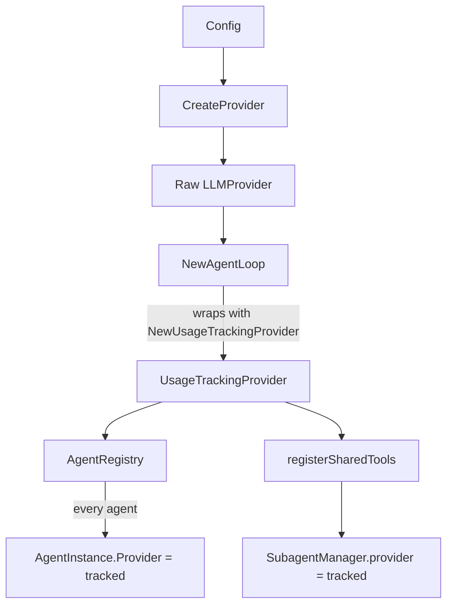
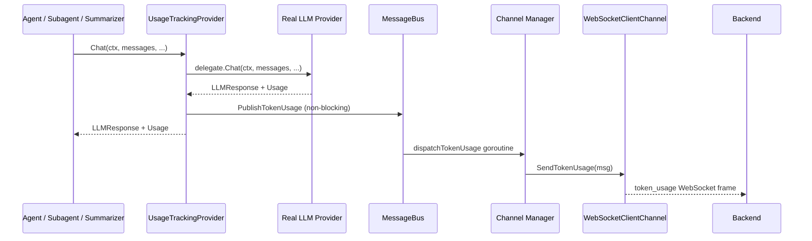
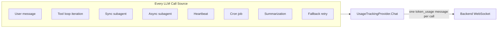

# Token Usage Tracking

PicoClaw reports every LLM token consumption as a dedicated `token_usage` WebSocket message. Each individual `Chat()` call is reported separately, in real time, the moment it completes. This guarantees that reported costs match the platform dashboard with zero leakage.

---

## How It Works

A `UsageTrackingProvider` wraps the raw LLM provider at startup (inside `NewAgentLoop`). Every single `Chat()` call anywhere in the system passes through this wrapper. After the underlying provider returns, the wrapper immediately publishes a `TokenUsageMessage` to the internal message bus, which is then dispatched as a `token_usage` WebSocket message to the backend.

There is one and only one interception point. No accumulation, no propagation through layers, no aggregation. Each API call is reported individually.

### Startup wiring



### Per-call flow



### All call sources covered



---

## WebSocket Message

Every LLM call produces exactly one `token_usage` message sent over the WebSocket connection:

```json
{
  "type": "token_usage",
  "chat_id": "user-abc123",
  "metadata": {
    "model":             "claude-haiku-4-5",
    "prompt_tokens":     "1234",
    "completion_tokens": "567",
    "total_tokens":      "1801",
    "pod_hostname":      "picoclaw-pod-abc123",
    "timestamp":         "2026-03-16T10:18:45Z"
  }
}
```

### Fields

| Field | Location | Type on wire | Description |
|---|---|---|---|
| `type` | top-level | string | Always `"token_usage"` |
| `chat_id` | top-level | string | The conversation/chat ID, from request context |
| `metadata.model` | metadata | string | The model used for this call |
| `metadata.prompt_tokens` | metadata | string (integer) | Input tokens for this single call — string-encoded because `Metadata` is `map[string]string` |
| `metadata.completion_tokens` | metadata | string (integer) | Output tokens for this single call — string-encoded |
| `metadata.total_tokens` | metadata | string (integer) | prompt + completion tokens — string-encoded |
| `metadata.pod_hostname` | metadata | string | Hostname of the pod that made the LLM call (`HOSTNAME` env var, fallback `"unknown"`) |
| `metadata.timestamp` | metadata | string (RFC3339) | UTC timestamp of when the message was dispatched |

`chat_id` is empty string when the call originates from a system-initiated path (cron, heartbeat, summarization) with no associated user conversation. Token count values are string-encoded integers because the `Metadata` field on all outbound WebSocket messages is `map[string]string` — parse them with `strconv.Atoi` on the backend.

---

## Coverage: Every Call Is Reported

| LLM Call Source | Reported? |
|---|---|
| User-initiated message (single iteration) | Yes |
| User-initiated message (multi-iteration tool loop) | Yes — one message per iteration |
| `message` tool mid-turn publish | Yes |
| Synchronous subagent (`subagent` tool) | Yes — each subagent iteration reported separately |
| Async subagent (goroutine spawn) | Yes — tracked through `SubagentManager.provider` |
| Heartbeat | Yes |
| Cron job | Yes |
| Summarization (background goroutine) | Yes — tracking context propagated via `context.Context` |
| Fallback/retry on error | Yes — each retry attempt is a separate call, reported separately |

---

## Architecture

### New file: `pkg/providers/usage_tracking.go`

Contains `UsageTrackingProvider`, the single interception point. Also exports `WithLLMTrackingContext` for attaching `chat_id` and `channel` to a context.

### `pkg/bus/types.go` — `TokenUsageMessage`

```go
type TokenUsageMessage struct {
    Channel          string `json:"channel"`
    ChatID           string `json:"chat_id"`
    Model            string `json:"model"`
    PromptTokens     int    `json:"prompt_tokens"`
    CompletionTokens int    `json:"completion_tokens"`
    TotalTokens      int    `json:"total_tokens"`
}
```

The internal bus message intentionally omits pod identity — each `WebSocketClientChannel` stamps its own `c.hostname` as `pod_hostname` when serialising to the wire, consistent with how `Send` and `sendEvent` work.

### `pkg/bus/bus.go`

Adds a dedicated `tokenUsage chan TokenUsageMessage` channel (buffer: 256). `PublishTokenUsage` is fire-and-forget — it never blocks the LLM call path. If the buffer is full, the message is dropped with a warning log.

### `pkg/channels/base.go` — `TokenUsageSender` interface

```go
type TokenUsageSender interface {
    SendTokenUsage(ctx context.Context, msg bus.TokenUsageMessage) error
}
```

Channels that implement this interface receive all usage messages. Currently implemented by `WebSocketClientChannel`.

### `pkg/channels/manager.go`

`dispatchTokenUsage` goroutine reads from the bus and broadcasts to every channel that implements `TokenUsageSender`.

### `pkg/channels/websocket_client/websocket_client.go`

`SendTokenUsage` serialises the message as a `token_usage` WebSocket frame.

---

## What Was Removed

The previous implementation accumulated tokens across iterations and propagated them upward through return values. This caused significant under-reporting because async paths (heartbeat, summarization, async subagents) had no return path to attach usage to.

Removed:
- `usageToMetadata()` helper function in `pkg/agent/loop.go`
- `totalUsage` / `hasUsage` accumulation variables in `runLLMIteration`
- `Usage *providers.UsageInfo` field on `ToolResult`
- `Usage *providers.UsageInfo` field on `ToolLoopResult`
- Usage propagation in `subagent.go`
- Usage metadata (`usage_prompt_tokens`, `usage_completion_tokens`, `usage_total_tokens`) from all `response` WebSocket messages

Response messages no longer carry any usage metadata. All cost data is in `token_usage` messages exclusively.
