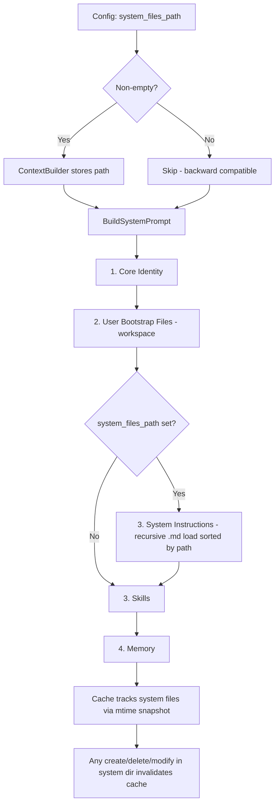

# Implementation Plan: System Files Path — Immutable System Instructions

**Status:** Ready for implementation  
**Touched files:** 4 modified, 1 new test file

---

## What This Feature Does

Adds support for a **separate directory of system-provided instruction files** that are loaded as additional, immutable context in the agent's system prompt. These files are:

- **Additive** — they do NOT replace or override user bootstrap files (`AGENTS.md`, `SOUL.md`, etc.)
- **Immutable from the agent's perspective** — mounted read-only at OS level by K8s
- **Freely updatable by the backend** — no risk of destroying user customizations
- **Recursively discovered** — any `.md` file in the directory tree is loaded
- **Deterministically ordered** — sorted by relative path for predictable prompt construction

### What This Feature Is NOT

- NOT a replacement for bootstrap files — `AGENTS.md`, `SOUL.md`, `USER.md`, `IDENTITY.md` remain user-editable in the workspace
- NOT related to skills loading — skills are handled by `PICOCLAW_BUILTIN_SKILLS` env var
- NOT a new file naming convention — the backend decides what `.md` files to place there

---

## System Prompt Structure (After Change)

```
┌──────────────────────────────────────┐
│ 1. Core Identity (hardcoded)         │  ← getIdentity()
├──────────────────────────────────────┤
│ 2. User Bootstrap Files              │  ← LoadBootstrapFiles()
│    AGENTS.md, SOUL.md, USER.md,      │    (workspace, user-editable)
│    IDENTITY.md                       │
├──────────────────────────────────────┤
│ 3. System Instructions  ← NEW       │  ← LoadSystemFiles()
│    Loaded from system_files_path     │    (read-only, backend-managed)
│    All .md files, sorted by path     │
├──────────────────────────────────────┤
│ 4. Skills Summary                    │  ← BuildSkillsSummary()
├──────────────────────────────────────┤
│ 5. Memory                            │  ← GetMemoryContext()
└──────────────────────────────────────┘
```

**Why system instructions come AFTER user bootstrap files:**
- They layer platform rules and restrictions ON TOP of user personality/identity
- LLM recency bias means later instructions carry more weight
- Restrictions placed after user content are harder to circumvent via prompt injection

---

## Example System Files Directory

```
/etc/picoclaw/
    00-core-behavior.md        ← Core platform behavior rules
    10-safety-guidelines.md    ← Safety and content policies
    20-product-features.md     ← Feature announcements
    30-restrictions.md         ← Hard restrictions
    integrations/
        api-usage.md           ← API-specific instructions
```

Filenames with numeric prefixes enable natural ordering. Nested directories are supported — files are sorted by their full relative path.

---

## File-by-File Changes

### 1. `pkg/config/config.go` — Add config field

Add `SystemFilesPath` to [`AgentDefaults`](pkg/config/config.go:170):

```go
SystemFilesPath string `json:"system_files_path,omitempty" env:"PICOCLAW_AGENTS_DEFAULTS_SYSTEM_FILES_PATH"`
```

Add `SystemFilesPath()` method on [`Config`](pkg/config/config.go:722):

```go
func (c *Config) SystemFilesPath() string {
    return expandHome(c.Agents.Defaults.SystemFilesPath)
}
```

- `omitempty` keeps it invisible in configs that don't use it
- `env` tag enables K8s pod to set via environment variable
- Empty string = disabled (full backward compatibility)

---

### 2. `pkg/agent/context.go` — Core changes

#### 2a. Add field to [`ContextBuilder`](pkg/agent/context.go:20)

```go
type ContextBuilder struct {
    workspace       string
    systemFilesPath string  // optional path to system-provided .md instruction files
    // ...rest unchanged
    
    // NEW: cache snapshot for system files (same pattern as skillFilesAtCache)
    systemFilesAtCache map[string]time.Time
}
```

#### 2b. Update [`NewContextBuilder`](pkg/agent/context.go:52) signature

```go
func NewContextBuilder(workspace string, systemFilesPath string) *ContextBuilder {
```

Store the field in the returned struct. No other logic changes in this function.

#### 2c. NEW method: `LoadSystemFiles`

Recursively walks `systemFilesPath`, collects all `.md` files, sorts by relative path, reads and concatenates them.

```go
func (cb *ContextBuilder) LoadSystemFiles() string {
    if cb.systemFilesPath == "" {
        return ""
    }
    
    var files []string
    filepath.WalkDir(cb.systemFilesPath, func(path string, d fs.DirEntry, err error) error {
        if err != nil || d.IsDir() {
            return nil
        }
        if strings.HasSuffix(strings.ToLower(d.Name()), ".md") {
            files = append(files, path)
        }
        return nil
    })
    sort.Strings(files)
    
    var sb strings.Builder
    for _, f := range files {
        data, err := os.ReadFile(f)
        if err != nil {
            continue
        }
        rel, _ := filepath.Rel(cb.systemFilesPath, f)
        fmt.Fprintf(&sb, "## %s\n\n%s\n\n", rel, data)
    }
    return sb.String()
}
```

#### 2d. Update [`BuildSystemPrompt`](pkg/agent/context.go:94)

Insert system files section between bootstrap files and skills:

```go
func (cb *ContextBuilder) BuildSystemPrompt() string {
    parts := []string{}
    parts = append(parts, cb.getIdentity())

    if bootstrap := cb.LoadBootstrapFiles(); bootstrap != "" {
        parts = append(parts, bootstrap)
    }

    // NEW: System instructions (immutable, from system_files_path)
    if systemContent := cb.LoadSystemFiles(); systemContent != "" {
        parts = append(parts, "# System Instructions\n\n"+systemContent)
    }

    if skills := cb.skillsLoader.BuildSkillsSummary(); skills != "" {
        parts = append(parts, fmt.Sprintf("# Skills\n\n...%s", skills))
    }

    if mem := cb.memory.GetMemoryContext(); mem != "" {
        parts = append(parts, "# Memory\n\n"+mem)
    }

    return strings.Join(parts, "\n\n---\n\n")
}
```

#### 2e. Update cache invalidation

**`systemFileRoots()`** — NEW helper returning `[]string{cb.systemFilesPath}` if non-empty, empty slice otherwise.

**[`buildCacheBaseline`](pkg/agent/context.go:222)** — Add system files walk alongside the existing skill files walk. Store results in `systemFilesAtCache`.

**[`sourceFilesChangedLocked`](pkg/agent/context.go:276)** — Add system file roots check (directory mtime) and system file tree check (reusing `skillFilesChangedSince` logic pattern or a shared `filesChangedSince` function).

**[`InvalidateCache`](pkg/agent/context.go:172)** — Reset `systemFilesAtCache` to nil.

This follows the exact same cache invalidation pattern already used for skills — proven, tested, and well-understood.

#### 2f. `LoadBootstrapFiles` — NO CHANGE

[`LoadBootstrapFiles`](pkg/agent/context.go:397) continues to load from workspace only. It is completely unaffected by this feature.

---

### 3. `pkg/agent/instance.go` — Pass config value

Update [`NewAgentInstance`](pkg/agent/instance.go:75):

```go
systemFilesPath := expandHome(defaults.SystemFilesPath)
contextBuilder := NewContextBuilder(workspace, systemFilesPath)
```

---

### 4. `pkg/agent/context_cache_test.go` — Signature update

All 14 `NewContextBuilder(tmpDir)` calls → `NewContextBuilder(tmpDir, "")`.

Empty string preserves workspace-only behavior. All existing test assertions remain valid.

---

### 5. `pkg/agent/context_system_files_test.go` — NEW test file

| Test | Description |
|---|---|
| `TestSystemFiles_LoadedIntoPrompt` | System files dir with 2 .md files → both appear in prompt under System Instructions section |
| `TestSystemFiles_SortedByPath` | Files with numeric prefixes are loaded in correct order |
| `TestSystemFiles_RecursiveDiscovery` | Nested directories are walked, files sorted by full relative path |
| `TestSystemFiles_NonMdFilesIgnored` | `.txt`, `.json` files in the directory are skipped |
| `TestSystemFiles_EmptyPath_NoEffect` | Empty `systemFilesPath` → no System Instructions section in prompt |
| `TestSystemFiles_CacheInvalidation_FileModified` | Modify a system file → cache rebuilds |
| `TestSystemFiles_CacheInvalidation_FileCreated` | Create new .md file in system dir → cache rebuilds |
| `TestSystemFiles_CacheInvalidation_FileDeleted` | Delete .md file from system dir → cache rebuilds |
| `TestSystemFiles_CoexistsWithBootstrapFiles` | Both workspace bootstrap files AND system files appear in prompt, in correct order |
| `TestSystemFiles_EmptyDirectory` | System path exists but contains no .md files → no System Instructions section |

---

### 6. `config/config.example.json` — Document the field

Add to `agents.defaults`:
```json
"system_files_path": ""
```

---

## Architecture Flow



---

## Cache Invalidation Strategy

Reuses the **exact pattern** from skill file cache invalidation:

| What | How | Existing pattern |
|---|---|---|
| System dir mtime change | `fileChangedSince` on dir path | Same as skill root dirs |
| File create/delete/modify | Walk tree, compare mtime snapshot | Same as `skillFilesAtCache` |
| Snapshot storage | `systemFilesAtCache map[string]time.Time` | Same as `skillFilesAtCache` |
| Snapshot reset | Set to `nil` in `InvalidateCache()` | Same as `skillFilesAtCache` |

---

## What Does NOT Change

- **Bootstrap files** — `AGENTS.md`, `SOUL.md`, `USER.md`, `IDENTITY.md` remain workspace-only, user-editable
- **Skills loading** — Handled by `PICOCLAW_BUILTIN_SKILLS` env var, no change
- **Memory** — Always workspace-relative, no change
- **Tool access** — `allow_read_paths` already handles agent read access, no change
- **DefaultConfig** — `SystemFilesPath` zero value is `""`, no change to `defaults.go`

---

## Backward Compatibility

When `system_files_path` is empty (default):
- Zero extra filesystem calls
- Zero extra content in system prompt
- All behavior identical to current code
- Local/desktop users are completely unaffected

---

## Scalability Properties

| Property | How |
|---|---|
| **Add new instruction files** | Drop a new `.md` file in the directory — auto-discovered on next prompt build |
| **Remove instruction files** | Delete the file — auto-detected by cache invalidation |
| **Organize with subdirectories** | Recursive walk supports nested dirs |
| **Control ordering** | Numeric prefixes on filenames: `00-core.md`, `10-safety.md`, `99-restrictions.md` |
| **Update without downtime** | Backend updates ConfigMap → K8s propagates → mtime changes → cache rebuilds |
| **No user impact** | System files are completely separate from workspace |

---

## Verification

1. `make test` — All existing tests pass after `NewContextBuilder` signature update
2. `make lint` — No lint errors
3. New tests cover: loading, ordering, recursion, filtering, cache invalidation, coexistence
4. No type assertions or type casts
5. All files stay under 300 lines
