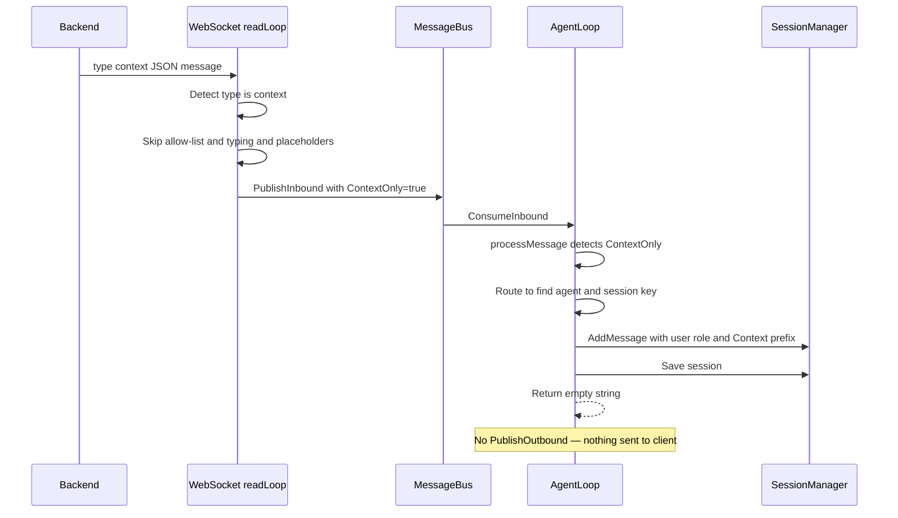

# WebSocket `context` Message Type

## Summary

Introduce a new `"context"` message type to the WebSocket client protocol. Context messages inject contextual information into the agent's session history without triggering LLM processing or sending any response back to the client.

## Motivation

Backend infrastructure sometimes needs to notify PicoClaw about events (e.g., "user upgraded plan", "new data available", "account settings changed") so the agent has this context in future conversations — without expecting or returning a response.

## Concrete Example

```
[14:00] Backend sends: type="context", content="User just upgraded to premium tier"
         → Saved to session history as: {role: "user", content: "[Context] User just upgraded to premium tier"}
         → NO LLM call. NO response to client. Silent.

[14:05] Real user sends: "What can I do now?"
         → LLM receives the full session context:
            [system prompt]
            [Context] User just upgraded to premium tier   ← injected at 14:00
            User: What can I do now?                      ← real user message now
         → LLM responds with knowledge of the premium upgrade
         → Response sent back to client normally
```

Context messages are **not** immediately sent to the LLM — they are stored in the session and become part of the context the LLM reads when the **next real user message** arrives.

## Data Flow



## Detailed Design

### 1. Bus layer — `pkg/bus/types.go`

Add a `ContextOnly` field to [`InboundMessage`](pkg/bus/types.go:18):

```go
type InboundMessage struct {
    // ... existing fields ...
    ContextOnly bool `json:"context_only,omitempty"` // true = inject into session history, no LLM response
}
```

When `true`, the agent loop injects the message into session history and skips LLM processing entirely.

### 2. WebSocket client — `pkg/channels/websocket_client/websocket_client.go`

Modify [`readLoop()`](pkg/channels/websocket_client/websocket_client.go:244) to detect `type: "context"` and route it through a dedicated path:

```go
// Inside readLoop(), after unmarshalling inMsg:

if inMsg.Type == "context" {
    // Context messages bypass allow-list checks, typing indicators,
    // and placeholders. They inject context into the agent session silently.
    logger.InfoCF(channelName, "Received context message", map[string]any{
        "user_id": inMsg.UserID,
        "chat_id": chatID,
        "length":  len(inMsg.Content),
    })
    c.handleContextMessage(chatID, senderID, inMsg)
    continue
}
```

Key behaviors for context messages:
- **No allow-list check** — context messages come from trusted backend infrastructure
- **No typing/reaction/placeholder triggers** — user sees no activity
- **No `HandleMessage()` call** — published directly to bus with `ContextOnly: true`

We'll route through a new [`BaseChannel.PublishContextMessage()`](pkg/channels/base.go:81) helper method.

### 3. BaseChannel helper — `pkg/channels/base.go`

Add a new method to [`BaseChannel`](pkg/channels/base.go:81):

```go
// PublishContextMessage publishes a context-only message to the bus.
// Unlike HandleMessage, this bypasses allow-list checks, typing indicators,
// reactions, and placeholders — context is injected into session silently.
func (c *BaseChannel) PublishContextMessage(
    ctx context.Context,
    senderID, chatID, content string,
    metadata map[string]string,
) error {
    msg := bus.InboundMessage{
        Channel:     c.name,
        SenderID:    senderID,
        ChatID:      chatID,
        Content:     content,
        Peer:        bus.Peer{Kind: "direct", ID: senderID},
        Metadata:    metadata,
        ContextOnly: true,
    }
    return c.bus.PublishInbound(ctx, msg)
}
```

### 4. Agent loop — `pkg/agent/loop.go`

Modify [`processMessage()`](pkg/agent/loop.go:429) to detect `ContextOnly` and handle it before the existing `msg.Channel == "system"` check:

```go
func (al *AgentLoop) processMessage(ctx context.Context, msg bus.InboundMessage) (string, error) {
    // ... existing logging ...

    // Handle context-only messages: inject into session, skip LLM
    if msg.ContextOnly {
        return al.handleContextInjection(ctx, msg)
    }

    // Route system messages to processSystemMessage (existing subagent logic)
    if msg.Channel == "system" {
        return al.processSystemMessage(ctx, msg)
    }
    // ... rest unchanged ...
}
```

New method `handleContextInjection`:

```go
func (al *AgentLoop) handleContextInjection(
    ctx context.Context,
    msg bus.InboundMessage,
) (string, error) {
    logger.InfoCF("agent", "Injecting context into session",
        map[string]any{
            "channel": msg.Channel,
            "chat_id": msg.ChatID,
            "length":  len(msg.Content),
        })

    // Route to find the correct agent and session
    route := al.registry.ResolveRoute(routing.RouteInput{
        Channel:   msg.Channel,
        AccountID: msg.Metadata["account_id"],
        Peer:      extractPeer(msg),
        GuildID:   msg.Metadata["guild_id"],
        TeamID:    msg.Metadata["team_id"],
    })

    agent, ok := al.registry.GetAgent(route.AgentID)
    if !ok {
        agent = al.registry.GetDefaultAgent()
    }
    if agent == nil {
        return "", fmt.Errorf("no agent available for context injection")
    }

    // Inject as user message with [Context] prefix
    agent.Sessions.AddMessage(
        route.SessionKey,
        "user",
        fmt.Sprintf("[Context] %s", msg.Content),
    )
    agent.Sessions.Save(route.SessionKey)

    return "", nil // No response — context injection is silent
}
```

Back in the main loop at [line 275](pkg/agent/loop.go:275), an empty response already means no outbound is published:

```go
if response != "" {
    // ... publish outbound ...
}
```

So returning `""` from `handleContextInjection` naturally suppresses any response.

### 5. Tests — `pkg/channels/websocket_client/websocket_client_test.go`

Add tests:

- **`TestReadLoop_ContextMessage_PublishedToBus`** — Send a `type: "context"` message via WS, verify it arrives on the bus with `ContextOnly: true` and correct `ChatID`, `SenderID`, `Content` fields
- **`TestReadLoop_ContextMessage_BypassesAllowList`** — Configure `allow_from` that would block the sender, verify context messages still get published (allow-list is skipped)
- **`TestReadLoop_ContextMessage_EmptyContent_Ignored`** — Verify empty content context messages are dropped, same as regular messages

### 6. Documentation — `docs/channels/websocket_client/README.md`

Add a new section under "Message Protocol" documenting the `context` message type, its fields, behavior, and a concrete usage example.

## Files Changed

| File | Change |
|------|--------|
| [`pkg/bus/types.go`](pkg/bus/types.go) | Add `ContextOnly bool` field to `InboundMessage` |
| [`pkg/channels/base.go`](pkg/channels/base.go) | Add `PublishContextMessage()` method |
| [`pkg/channels/websocket_client/websocket_client.go`](pkg/channels/websocket_client/websocket_client.go) | Handle `type: "context"` in `readLoop()` |
| [`pkg/agent/loop.go`](pkg/agent/loop.go) | Add `handleContextInjection()`, call from `processMessage()` |
| [`pkg/channels/websocket_client/websocket_client_test.go`](pkg/channels/websocket_client/websocket_client_test.go) | Add context message tests |
| [`docs/channels/websocket_client/README.md`](docs/channels/websocket_client/README.md) | Document context message type |

## Risks & Mitigations

| Risk | Mitigation |
|------|------------|
| No naming conflict with existing `system` channel | `ContextOnly` flag and `type: "context"` are completely independent of the `msg.Channel == "system"` subagent routing. |
| Session bloat from too many context messages | Same session/summarization infrastructure applies. If a session grows large, existing summarization will compress it. |
| Backend sending malformed context messages | Same validation as regular messages: empty content is already ignored in `readLoop()`. |
